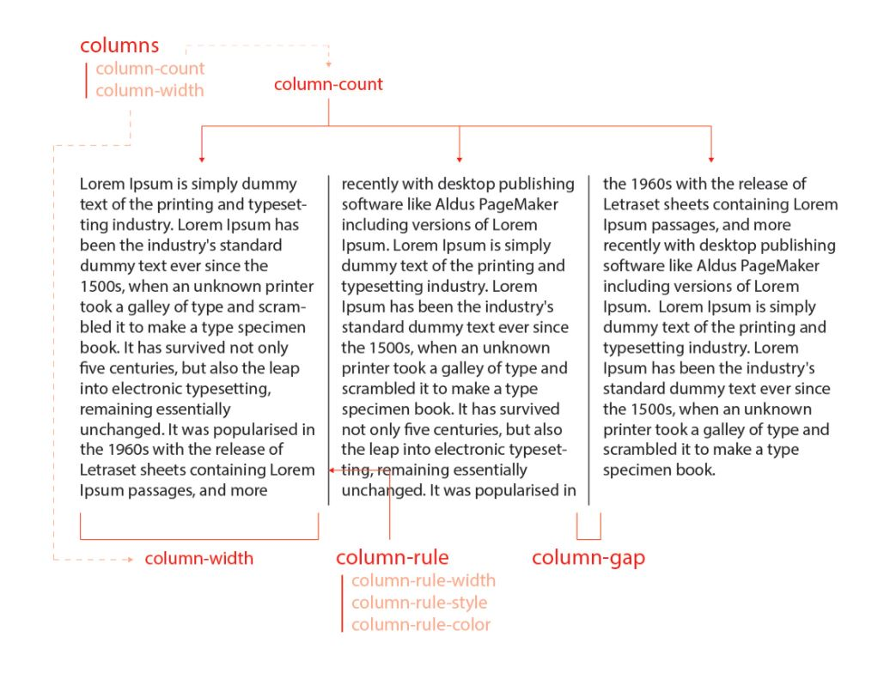

# 6일차

## CSS 속성 - 전환 & 변환
### 전환(Transitions)
> CSS 속성의 `전환` 효과를 지정

- transition : CSS 속성의 시작과 끝을 지정(전환 효과)하여 중간 값을 애니메이션

    |값|	의미|	기본값|
    |--|------|-------|
    |transition-property|	전환 효과를 사용할 속성 이름|	all|
    |transition-duration|	전환 효과의 지속시간 설정|	0s|
    |transition-timing-function|	타이밍 함수 지정|	ease|
    |transition-delay|	전환 효과의 대기시간 설정|	0s|

    - 단축 속성이다.

        ```css
        transition: 속성이름 지속시간 [타이밍함수 대기시간];

        .box {
        height: 100px;
        background: red;
        transition: all 2s;
        /* transition-property : height, background */
        /* transition-duration : 2s */
        /* 시간으로 한다면 transition: duration, delay */
        }
        .box:hover {
        height: 50px;
        background: blue;
        }
        ```

    - transition-timing-function : 타이밍 함수(애니메이션 전환 효과를 계산하는 방법) 지정

        |값|의미|기본값|Cubic Bezier 값|
        |---|----|-----|-----|
        |ease|	빠르게 - 느리게	|ease	|cubic-bezier(.25, .1, .25, 1)|
        |linear|	일정하게|		|cubic-bezier(0, 0, 1, 1)|
        |ease-in|	느리게 - 빠르게|		|cubic-bezier(.42, 0, 1, 1)|
        |ease-out|	빠르게 - 느리게|		|cubic-bezier(0, 0, .58, 1)|
        |ease-in-out|	느리게 - 빠르게 - 느리게|		|cubic-bezier(.42, 0, .58, 1)|
        |cubic-bezier(n,n,n,n)|	자신만의 값을 정의(0~1)|		|
        |steps(n)|	n번 분할된 애니메이션||

## 변환(Transforms)
> 요소의 변환 효과 지정

- transform : 요서의 변환 효과(변형)를 지정

    ```css
    transform: 변환함수1 변환함수2 변환함수3...;
    transform: 원근법 이동 크기 회전 기울임;

    .box {
    transform: rotate(20deg) translate(10px, 0);
    }
    ```

    - `transform`의 2D 변환 함수

        |값(변환함수)|의미|단위|
        |-----|-----|-----|
        |translate(x, y)|이동(X축, Y축)|단위|
        |translateX(x)|이동(X축)|단위|
        |translateY(y)|이동(Y축)|단위|
        |scale(x, y)|크기(X축, Y축)|없음(배수)|
        |scaleX(x)|크기(X축)|없음(배수)|
        |scaleY(y)|크기(Y축)|없음(배수)|
        |rotate(degree)|회전(각도)|deg|
        |skew(x-deg, y-deg)|기울임(X축, Y축)|deg|
        |skewX(x-deg)|기울임(X축)|deg|
        |skewY(y-deg)|기울임(Y축)|deg|
        |matrix(n,n,n,n,n,n)|2차원 변환 효과|없음|

        - 배치하고 끝내는 경우 : `position`(애니메이션에 비적합)
        - 언제든 이동할 필요가 있는 경우 : `translate`(애니메이션에 최적화)

    - `transform`의 3D 변환 함수

        |값(변환함수)|의미|단위|
        |-----|-----|-----|
        |translate3d(x, y, z)|이동(X축, Y축, Z축)|단위|
        |translateZ(z)|이동(Z축)|단위|
        |scale3d(x, y, z)|크기(X축, Y축, Z축)|없음(배수)|
        |scaleZ(z)|크기(Z축)|없음(배수)|
        |rotate3d(x, y, z, a)|회전(X벡터, Y벡터, Z벡터, 각도)|없음, deg|
        |rotateX(x)|회전(X축)|deg|
        |rotateY(y)|회전(Y축)|deg|
        |rotateZ(z)|회전(Z축)|deg|
        |perspective(n)|원근법(거리)|단위|
        |matrix3d(n,n,n,n,n,n,n,n,n,n,n,n,n,n,n,n)|3차원 변환 효과|없음|
    
### transform 변환 속성
> [예제](transform-style.html)

|속성|의미|
|----|----|
|transform-origin|요소 변환의 기준점을 설정|
|transform-style|3D 변환 요소의 자식 요소도 3D 변환을 사용할지 설정|
|perspective|하위 요소를 관찰하는 원근 거리를 설정|
|perspective-origin|원근 거리의 기준점을 설정|
|backface-visibility|3D 변환으로 회전된 요소의 뒷면 숨김을 설정|

- transform-origin : 요소 변환의 기분점 설정

    |값|의미|기본값|
    |--|----|------|
    |X축|left, right, center, %, 단위|50%|
    |Y축|top, bottom, center, %, 단위|50%|
    |Z축|단위|0|

    - 기본적으로 y축이 반전되어 있다.

- transform-style : 3D 변환 요소의 자식 요소도 3D 변환을 사용할지 설정

    |값|의미|기본값|
    |--|----|------|
    |flat|자식 요소의 3D 변환을 사용하지 않음|flat|
    |preserve-3d|자식 요소의 3D 변환을 사용함||

    - preserve-3d 속성을 제거하면 자식 요소의 3D 변환 효과가 적용되지 않는다.

- perspective : 하위 요소를 관찰하는 원근 거리 설정
    - perspective 속성과 함수의 차이점

        |속성/함수|적용대상|기준점 설정|
        |---------|--------|-----------|
        |perspective|관찰 대상의 부모 요소|perspective-origin|
        |transform: perspective()|관찰 대상|transform-origin|

        - perspective 속성은 관찰 대상의 부모(조상) 요소에 적용하여 하위 요소들을 관찰하는 원근 거리를 설정하며, transform: perspective() 변환 함수는 관찰 대상에 직접 적용하여 그 대상을 관찰하는 원근 거리를 설정한다.

- perspective-origin : 원근 거리의 기준점을 설정

- backface-visibility : 3D 변환으로 회전된 요소의 뒷면 숨김을 설정

### matrix(a, b, c, d, e, f)
> 요소의 2차원 변환(Transforms) 효과를 지정
> - scale(), skew(), translate(), rotate()

- 요소에 일반 변환(Transforms) 함수(2D, 3D)를 사용하더라도 브라우저에 의해 matrix 함수로 계산되어 적용된다.
  - 2D 변환 함수는 matrix로, 3D 변환 함수는 matrix3d로 변환된다.
  - 즉 일반적인 경우는 matrix 함수가 아닌 일반 변환 함수를 사용하면 된다.

## CSS 속성 - Animation
### animation
> 요소에 애니메이션을 설정/제어

- 단축 속성이다.

- transition이 전, 후(0%, 100%)만 제어된다면, animation은 전, 중, 후(0%, ..., 100%)가 제어된다.

|값|의미|기본값|
|--|----|------|
|animation-name|@keyframes규칙의 이름을 지정|none|
|animation-duration|애니메이션의 지속 시간 설정|0s|
|animation-timing-function|타이밍 함수 지정|ease|
|animation-delay|애니메이션의 대기 시간 설정|0s|
|animation-iteration-count|애니메이션의 반복 횟수 설정|1|
|animation-direction|애니메이션의 반복 방향 설정|normal|
|animation-fill-mode|애니메이션의 전후 상태(위치) 설정|none|
|animation-play-state|애니메이션의 재생과 정지 설정|running|

```css
animation: 애니메이션이름 지속시간 [타이밍함수 대기시간 반복횟수 반복방향 전후상태 재생/정지];

.box {
  width: 100px;
  height: 100px;
  background: tomato;
  animation: hello 2s linear infinite both;
}

@keyframes hello {
  0% { width: 200px; }
  100% { width: 50px; }
}
```

- animation-name : @keyframes 규칙(애니메이션 프레임)의 이름을 지정

- animation-duration : 애니메이션의 지속 시간 설정

- animation-timing-function : 타이밍 함수(애니메이션 효과를 계산하는 방법) 지정

    |값|의미|기본값|Cubic Bezier 값|
    |---|----|-----|-----|
    |ease|	빠르게 - 느리게	|ease	|cubic-bezier(.25, .1, .25, 1)|
    |linear|	일정하게|		|cubic-bezier(0, 0, 1, 1)|
    |ease-in|	느리게 - 빠르게|		|cubic-bezier(.42, 0, 1, 1)|
    |ease-out|	빠르게 - 느리게|		|cubic-bezier(0, 0, .58, 1)|
    |ease-in-out|	느리게 - 빠르게 - 느리게|		|cubic-bezier(.42, 0, .58, 1)|
    |cubic-bezier(n,n,n,n)|	자신만의 값을 정의(0~1)|		|
    |steps(n)|	n번 분할된 애니메이션||

- animation-delay : 애니메이션의 대기 시간 설정
  - 음수가 허용되며 음수가 있다면 그 값만큼 애니메이션이 앞서 시작한다(애니메이션 주기 도중에 시작).

- animation-iteration-count : 애니메이션의 반복 횟수를 설정

    |값|의미|기본값|
    |--|----|------|
    |숫자|반복 횟수를 설정|1|
    |infinite|무한 반복||

- animation-direction : 애니메이션의 반복 방향을 설정

    |값|의미|기본값|
    |--|----|------|
    |normal|정방향만 반복|normal|
    |reverse|역방향만 반복||
    |alternate|정방향에서 역방향으로 반복(왕복)||
    |alternate-reverse|역방향에서 정방향으로 반복(왕복)||

- animation-fill-mode : 애니메이션의 전후 상태(위치)를 설정

    |값|의미|기본값|
    |--|----|------|
    |none|기존 위치에서 시작 -> 애니메이션 시작 위치로 이동 -> 동작 -> 기존 위치에서 끝|none|
    |forwards|기존 위치에서 시작 -> 애니메이션 시작 위치로 이동 -> 동작 -> 애니메이션 끝 위치에서 끝||
    |backwards|애니메이션 시작 위치에서 시작 -> 동작 -> 기존 위치에서 끝||
    |both|애니메이션 시작 위치에서 시작 -> 동작 -> 애니메이션 끝 위치에서 끝||

- animation-play-state : 애니메이션의 재생과 정지를 설정

    |값|의미|기본값|
    |--|----|------|
    |running|애니메이션을 동작|running|
    |paused|애니메이션 동작을 정지||

## CSS 속성 - Multi-Columns
> 일반 블록 레이아웃을 확장하여 여러 텍스트 다단으로 쉽게 정리하며, 가독성 확보

<div align=center>



</div>

### columns
> 다단 정의

|값|의미|기본값|
|--|----|------|
|auto|브라우저가 단의 너비와 개수를 설정|auto|
|column-width|단의 최적 너비를 설정|auto|
|column-count|단의 개수를 설정|auto|

- column-width
  - 각 단이 줄어들 수 있는 최적 너비(최소 너비)를 설정하며, 요소의 너비가 가변하여 하나의 단이 최적 너비보다 줄어들 경우 단의 개수가 조정된다.

```css
columns: 너비 개수;

.text {
  columns: 100px 2;
}
```

### column-gap
> 단과 단 사이의 간격 설정


|값|의미|기본값|
|--|----|------|
|normal|브라우저가 단과 단 사이의 간격을 설정(1em)|normal|
|단위|px, em, cm 등 단위로 지정|

### column-rule
> 단과 단 사이의 (구분)선을 지정

|값|의미|기본값|
|--|----|------|
|column-width|선의 두께를 지정|medium|
|column-style|선의 종류를 지정|none|
|column-color|선의 색상을 지정|요소의 글자색과 동일|

- 구분선(column-rule)은 단과 단 사이의 간격 중간에 위치한다.

### column-rule-width
> 단과 단 사이 선의 두께 설정

|값|의미|기본값|
|--|----|------|
|medium|중간 두께 선|medium|
|thin|얇은 두께 선||
|thick|두꺼운 두께 선||
|단위|px, em, cm 등 단위로 지정||

### column-rule-style
> 단과 단 사이 선의 종류 설정

|값|의미|기본값|
|--|----|------|
|none|선 없음|none|
|hidden|선 없음과 동일(table요소에서 사용)||
|solid|실선(일반선)||
|dotted|점선||
|dashed|파선||
|double|두 줄선||
|groove|홈이 파여있는 모양(선)||
|ridge|솟은 모양(선, groove의 반대)||
|inset|요소 전체가 들어간 모양(선)||
|outset|요소 전체가 나온 모양(선)||

### column-rule-color
> 단과 단 사이 선의 색상 설정