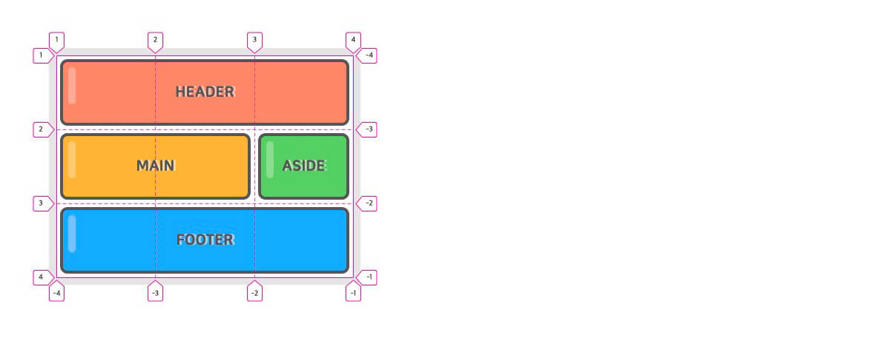

# 7일차

## CSS 속성 - Grid
> CSS Grid(그리드)는 2차원(행과 열)의 레이아웃 시스템을 제공

- `CSS Grid` : 예전부터 핵(Hack)으로 불린 다양한 레이아웃 대체 방식들을 해결하기 위해 만들어진 특별한 CSS 모듈
- `Grid Properties` : CSS Flex와 같이 Container(컨테이너)와 Item(아이템)이라는 두 가지 개념으로 구분되어 있다.

### Grid Container Properties

|속성|의미|
|----|----|
|display|그리드 컨테이너(Container)를 정의|
|grid-template-rows|명시적 행(Track)의 크기를 정의|
|grid-template-columns|명시적 열(Track)의 크기를 정의|
|grid-template-areas|영역(Area) 이름을 참조해 템플릿 생성|
|grid-template|grid-template-xxx의 단축 속성|
|row-gap(grid-row-gap)|행과 행 사이의 간격(Line)을 정의|
|column-gap(grid-column-gap)|열과 열 사이의 간격(Line)을 정의|
|gap(grid-gap)|xxx-gap의 단축 속성|
|grid-auto-rows|암시적인 행(Track)의 크기를 정의|
|grid-auto-columns|암시적인 열(Track)의 크기를 정의|
|grid-auto-flow|자동 배치 알고리즘 방식을 정의|
|grid|grid-template-xxx과 grid-auto-xxx의 단축 속성|
|align-content|그리드 콘텐츠(Grid Contents)를 수직(열 축) 정렬|
|justify-content|그리드 콘텐츠를 수평(행 축) 정렬|
|place-content|align-content와 justify-content의 단축 속성|
|align-items|그리드 아이템(Items)들을 수직(열 축) 정렬|
|justify-items|그리드 아이템들을 수평(행 축) 정렬|
|place-items|align-items와 justify-items의 단축 속성|

- display : Grid Container(컨테이너)를 정의하며, 컨테이너의 자식 요소들은 자동으로 Grid Items(아이템)로 정의된다.

    |값|의미|
    |----|----|
    |grid|Block 특성의 Grid Container를 정의|
    |inline-grid|Inline 특성의 Grid Container를 정의|

    ```css
    .container {
    display: grid;
    }
    ```

- grid-template-rows : 명시적 행(Track)의 크기를 정의한다.

  ```css
  .container {
  display: grid;
  grid-template-rows: 1행크기 2행크기 ...;
  grid-template-rows: [선이름] 1행크기 [선이름] 2행크기 [선이름] ...;
  }

  /* 각 행의 크기를 정의합니다. */
  .container {
  grid-template-rows: 100px 200px;
  }
  /* 동시에 각 라인의 이름도 정의할 수 있습니다. */
  .container {
  grid-template-rows: [first] 100px [second] 200px [third];
  }
  /* 라인에 중복된 이름을 지정할 수 있습니다. */
  .container {
  grid-template-rows: [row1-start] 100px [row1-end row2-start] 200px [row2-end];
  }
    ```
  - 라인(Line)의 이름도 정의할 수 있다.
  - fr(fraction, 공간 비율) 단위를 사용할 수 있다.
  - repeat() 함수를 사용할 수 있다.
  - 각 라인은 행(Row, Track)과 열(Column, Track)의 개수대로 숫자(양수/음수) 라인 이름이 자동으로 지정되어 있어서, 꼭 필요한 경우가 아니면 라인 이름을 정의할 필요가 없다.
    ```css
    .container {
    grid-template-rows: 100px 200px;
    /* grid-template-rows: [1 -3] 100px [2 -2] 200px [3 -1]; */
    }

    .container {
    width: 400px;
    display: grid;
    grid-template-rows: repeat(3, 100px);
    grid-template-columns: repeat(3, 1fr);
    }
    ```
    <div align=center>
    
    
    
    </div>

- grid-template-columns : 명시적 열(Track)의 크기를 정의한다.

라인(Line)의 이름도 정의할 수 있다.
fr(fraction, 공간 비율) 단위를 사용할 수 있다.
repeat() 함수를 사용할 수 있다.

```css
.container {
  display: grid;
  grid-template-columns: 1열크기 2열크기 ...;
  grid-template-columns: [선이름] 1열크기 [선이름] 2열크기 [선이름] ...;
}
/* 각 열의 크기를 정의합니다. */
.container {
  grid-template-columns: 100px 200px;
}
/* 동시에 각 라인의 이름도 정의할 수 있습니다. */
.container {
  grid-template-columns: [first] 100px [second] 200px [third];
}
/* 라인에 중복된 이름을 지정할 수 있습니다. */
.container {
  grid-template-columns: [col1-start] 100px [col1-end col2-start] 200px [col2-end];
}
```
```css
/* 1200px 너비의 ‘12컬럼 그리드 템플릿’을 정의한다면 다음과 작성 */
.container {
  width: 1200px;
  grid-template-columns: 100px 100px 100px 100px 100px 100px 100px 100px 100px 100px 100px 100px;
}
```
```css
/* repeat() 함수로 간소화하기 */
.container {
  width: 1200px;
  grid-template-columns: repeat(12, 100px);
}
```

- 컬럼을 크기를 fr 단위를 사용해 다음과 같이 비율로 지정할 수도 있다.
  - 각 컬럼은 비율에 맞게 출력되기 때문에 컨테이너의 너비가 가변해도 열 크기를 수정할 필요가 없다.
  
  ```css
  .container {
    width: 80%;
    grid-template-columns: repeat(12, 1fr);
  }
  ```
  ```css
  /* repeat() 함수는 2번째 인수를 반복하기 때문에 다음과 같이 활용할 수 있다. */
  .container {
    grid-template-columns: repeat(4, 100px 200px 50px);
    /* grid-template-columns: 100px 200px 50px 100px 200px 50px 100px 200px 50px 100px 200px 50px; */
  }
  .container {
    grid-template-columns: repeat(4, 1fr 2fr 3fr);
    /* grid-template-columns: 1fr 2fr 3fr 1fr 2fr 3fr 1fr 2fr 3fr 1fr 2fr 3fr; */
  }
  ```

- grid-template-areas : 지정된 그리드 영역 이름(grid-area)을 참조해 그리드 템플릿을 생성
  - grid-area는 Grid Container가 아닌 Grid Item에 적용하는 속성이다.

  ```css
    .container {
    display: grid;
    grid-template-rows: repeat(3, 100px);
    grid-template-columns: repeat(3, 1fr);
    grid-template-areas:
        "header header header"
        "main main aside"
        "footer footer footer";
    }
    header { grid-area: header; }
    main   { grid-area: main;   }
    aside  { grid-area: aside;  }
    footer { grid-area: footer; }
  ```
  <div align=center>
  
  
  
  </div>

  ```css
  /* .(마침표)를 사용하거나 명시적으로 none을 입력해 빈 영역을 정의할 수 있다. */
  .container {
  display: grid;
  grid-template-rows: repeat(4, 100px);
  grid-template-columns: repeat(3, 1fr);
  grid-template-areas:
      "header header header"
      "main . ."
      "main . aside"
      "footer footer footer";
  }
  header { grid-area: header; }
  main   { grid-area: main;   }
  aside  { grid-area: aside;  }
  footer { grid-area: footer; }
  ```
 <div align=center>
  
  
  
  </div>

- grid-template : `grid-template-rows`, `grid-template-columns`, `grid-template-areas`의 단축 속성이다.

    ```css
    .container {
    grid-template: <grid-template-rows> / <grid-template-columns>;
    grid-template: <grid-template-areas>;
    }
    /* 다음과 같이 작성할 수도 있다. */
    .container {
    grid-template:
        [1행시작선이름] "AREAS" 행너비 [1행끝선이름]
        [2행시작선이름] "AREAS" 행너비 [2행끝선이름]
        / <grid-template-columns>;
    }
    .container {
    display: grid;
    grid-template:
        "header header header" 80px
        "main main aside" 350px
        "footer footer footer" 130px
        / 2fr 100px 1fr;
    }
    header { grid-area: header; }
    main   { grid-area: main; }
    aside  { grid-area: aside; }
    footer { grid-area: footer; }
    /* 다음과 같이 해석된다. */
    .container {
    display: grid;
    grid-template-rows: 80px 350px 130px;
    grid-template-columns: 2fr 100px 1fr;
    grid-template-areas:
        "header header header"
        "main main aside"
        "footer footer footer";
    }
    ```

- row-gap(grid-row-gap) : 각 행과 행 사이의 간격(Gutter)을 지정
  - 그리드 선(Grid Line)의 크기를 지정하는 것
  ```css
  .container {
  row-gap: 크기;
  }
    ```

- column-gap(grid-column-gap) : 각 열과 열 사이의 간격(Gutter)을 지정
  ```css
  .container {
  column-gap: 크기;
  }
  ```

- gap(grid-gap) : 각 행과 행, 열과 열 사이의 간격(Gutter)을 지정
  ```css
  .container {
  gap: <grid-row-gap> <grid-column-gap>;
  }
  .container {
  display: grid;
  grid-template-rows: repeat(2, 150px);
  grid-template-columns: repeat(3, 1fr);
  gap: 20px 10px;
  }
  /* 하나의 값으로 통일 가능 */
  .container {
  gap: 10px;  /* row-gap: 10px; + column-gap: 10px; */
  }
  /* 하나의 값만 적용하고자 한다면 다음과 같이 사용 */
  .container {
  gap: 10px 0; /* row-gap */
  gap: 0 10px; /* column-gap */
  }
  ```
  <div align=center>
  
  
  
  </div>

  - grid-gap(grid-row-gap, grid-column-gap)의 접두사 grid-는 더 이상 사용되지 않으며(Deprecated), gap(row-gap, column-gap)로 교체

- grid-auto-rows : 암시적 행(Track)의 크기를 정의
  - 아이템(Item)이 grid-template-rows로 정의한 명시적 행 외부에 배치되는 경우 암시적 행의 크기가 적용
  ```css
    .container {
    width: 300px;
    height: 200px;
    display: grid;
    grid-template-rows: 100px 100px; /* 명시적 2개 행 정의 */
    grid-template-columns: 150px 150px; /* 명시적 2개 열 정의 */
    grid-auto-rows: 100px; /* 그 외(암시적) 행의 크기 정의 */
    }
    .item:nth-child(3) {
    grid-row: 3 / 4;
    }
  ```
  ```html
    <div class="container">
    <div class="item">1</div>
    <div class="item">2</div>
    <div class="item">3</div>
    </div>
  ```
  <div align=center>
  
  
  
  </div>

- grid-auto-columns : 암시적 열(Track)의 크기를 정의
  - 아이템(Item)이 grid-template-columns로 정의한 명시적 열 외부에 배치되는 경우 암시적 열의 크기가 적용

  ```css
  .container {
  width: 300px;
  height: 200px;
  display: grid;
  grid-template-rows: 100px 100px;
  grid-template-columns: 150px 150px;
  grid-auto-rows: 100px;
  grid-auto-columns: 100px;
  }
  .item:nth-child(3) {
  grid-row: 3 / 4;
  grid-column: 3 / 4;
  }
  ```
  <div align=center>
  
  

  </div>

  - 다음과 같이 아이템이 배치되는 위치에 맞게 암시적 행과 열의 개수가 생성되며, 암시적 크기가 적용된 행과 열은 양수 라인 번호만 사용할 수 있다(음수 사용 불가).
  
  <div align=center>

  
  
  </div>

- grid-auto-flow : 배치하지 않은 아이템(Item)을 어떤 방식의 ‘자동 배치 알고리즘’으로 처리할지 정의
  - 배치한 아이템은 grid-area(이하 개별 속성 포함)를 사용한 아이템을 의미

  |값|의미|기본값|
  |--|----|------|
  |row|각 행 축을 따라 차례로 배치|row|
  |column|각 열 축을 따라 차례로 배치||
  |row dense(dense)|각 행 축을 따라 차례로 배치, 빈 영역 메움!||
  |column dense|각 열 축을 따라 차례로 배치, 빈 영역 메움!||
  
  ```css
  /* For row & row dense */
  .container {
    display: grid;
    grid-template-rows: repeat(3, 1fr);
    grid-template-columns: repeat(3, 1fr);
    grid-auto-flow: row || row dense || dense;
  }
  .item:nth-child(2) {
    grid-column: span 3;
  }
  ```
  
  <div align=center>

  
  
  </div>

  ```css
    /* For column & column dense */
    .container {
    display: grid;
    grid-template-rows: repeat(3, 1fr);
    grid-template-columns: repeat(3, 1fr);
    grid-auto-flow: column || column dense;
    }
    .item:nth-child(1) {
    grid-column: 2 / span 2;
    }
    .item:nth-child(2) {
    grid-column: span 2;
    }
  ```
  
  <div align=center>

  
  
  </div>

- grid : grid-template-xxx과 grid-auto-xxx의 단축 속성

### Grid Item Properties

|속성|의미|
|----|----|
|grid-row-start|그리드 아이템(Item)의 행 시작 위치 지정|
|grid-row-end|그리드 아이템의 행 끝 위치 지정|
|grid-row|grid-row-xxx의 단축 속성(행 시작/끝 위치)|
|grid-column-start|그리드 아이템의 열 시작 위치 지정|
|grid-column-end|그리드 아이템의 열 끝 위치 지정|
|grid-column|grid-column-xxx의 단축 속성(열 시작/끝 위치)|
|grid-area|영역(Area) 이름을 설정하거나, grid-row와 grid-column의 단축 속성|
|align-self|단일 그리드 아이템을 수직(열 축) 정렬|
|justify-self|단일 그리드 아이템을 수평(행 축) 정렬|
|place-self|align-self와 justify-self의 단축 속성|
|order|그리드 아이템의 배치 순서를 지정|
|z-index|그리드 아이템의 쌓이는 순서를 지정|